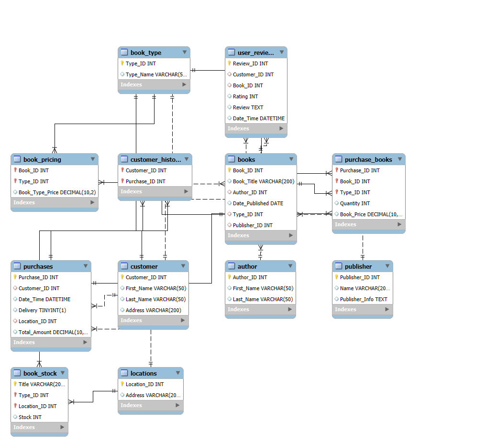

# Online Bookstore Inventory Database System

An enterprise-focused MySQL database designed to manage inventory tracking, sales transactions, user access roles, and customer reviews for a multi-location bookstore system.

## 📌 Project Overview

This relational database schema handles real-world retail and inventory workflows for an online bookstore. It enforces relational integrity across catalog items, stock distribution across physical and warehouse locations, pricing models, transaction histories, and user reviews.

### Key Capabilities

* **Multi-Location Inventory:** Tracks stock levels across individual warehouses and storefronts.
* **Relational Catalog:** Separates authors, publishers, categories, and pricing tiers into normalized entities.
* **Transactional Integrity:** Maps customer orders to detailed line-item breakdown records.
* **Role-Based Access Control (RBAC):** Configures segregated privileges for query access versus administrative control.

## 🛠️ Database Architecture

The database consists of interconnected tables organized across core functional areas.



> **Note on Schema Design & Pragmatic Normalization:**
> Core catalog entities follow strict 3rd Normal Form (3NF). Transactional tables (such as `purchase_books` and `book_stock`) utilize intentional pragmatic denormalization—such as preserving order-time title snapshots and transaction prices—to guarantee transaction immutability and optimize schema compatibility for future integration with a NoSQL document caching layer.

## 📂 Repository Structure

All SQL scripts are located in the `scripts/` directory and build the system in order:

1. `scripts/01_schema.sql` – Defines table structures, primary keys, and foreign key constraints.
2. `scripts/02_seed_data.sql` – Populates mock data for testing (authors, books, locations, customers, orders).
3. `scripts/03_queries.sql` – Runs business intelligence reports, multi-table JOINs, and analytics.
4. `scripts/04_admin.sql` – Configures user access control (`readonly_user` and `admin_user`) and safe update toggles.

## 🚀 Quick Start Guide

### Prerequisites

* **MySQL Server 8.0+** or **MySQL Workbench**

### Installation

Run the SQL build scripts sequentially in your SQL client or CLI:

```sql
SOURCE scripts/01_schema.sql;
SOURCE scripts/02_seed_data.sql;
SOURCE scripts/03_queries.sql;
SOURCE scripts/04_admin.sql;
